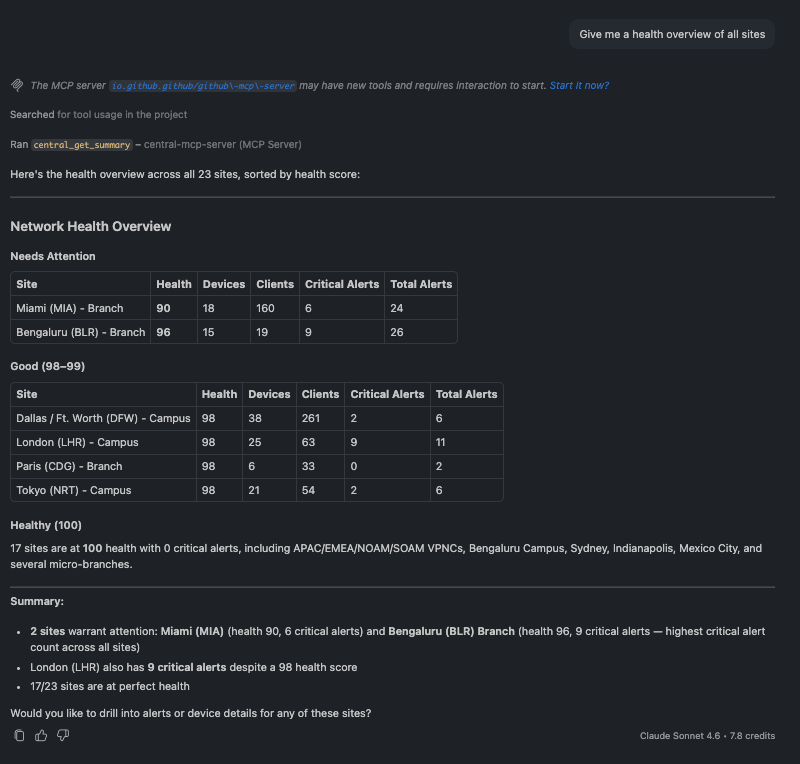
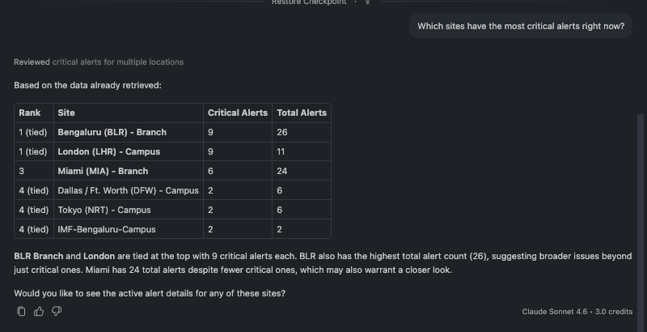
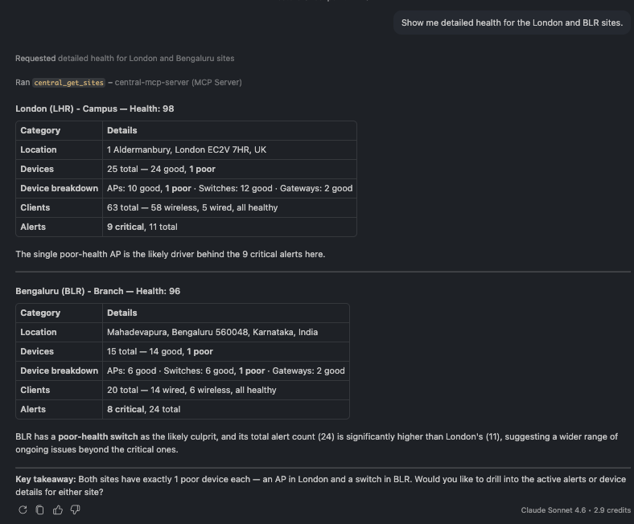
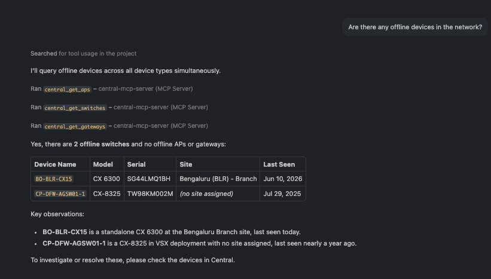
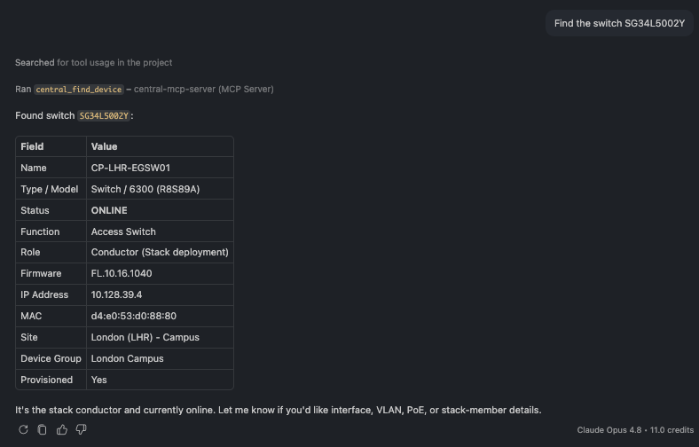
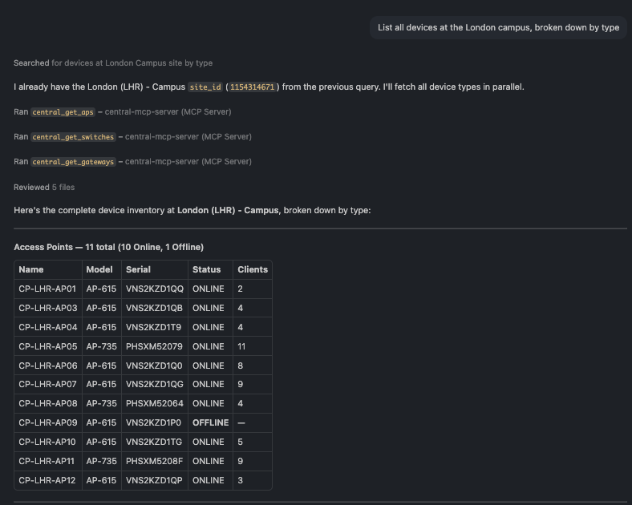

# What You Can Ask

The Central MCP server turns your HPE Aruba Networking Central data into something you can simply
*ask about* in plain English. You don't open a dashboard, remember a site ID, or write an API
call — you ask a question, and the AI assistant figures out which Central data to pull and answers
from live network state.

This guide is a tour of what's possible. It's written for network engineers who are new to AI
assistants: every section shows a real question, the answer it returns, and a short list of related
questions you can ask in the same area. Pick the ones that match your day-to-day and try them in
your own environment — the numbers will be yours, but the *kind* of answer will be the same.

> **All examples are read-only and live.** Every question here was run against a real Central
> environment. The assistant only reports what the live data shows — it never makes changes
> (the one exception, port bouncing, always asks for your confirmation first; see
> [Troubleshooting & Diagnostics](#10-troubleshooting--diagnostics)).

---

## How to ask

A few things make the assistant feel natural to work with:

- **Use plain language.** "Which sites are unhealthy?" works as well as a precise query. You don't
  need exact tool names or syntax.
- **You don't need IDs up front.** Ask about "the London campus" or "the Miami branch" by name —
  the assistant resolves names to the right site behind the scenes.
- **Follow-ups keep context.** Ask "are there any offline devices in London?", then just
  "when did that AP go down?" — the assistant remembers what you were looking at.
- **Start broad, then drill in.** A good first question is "give me a health overview of all
  sites." From there, zoom into whatever needs attention.

The sections below follow that same path — from a network-wide view down to a single port.

---

## 1. Network Health Overview

Start here. One question gives you a ranked, at-a-glance picture of every site so you know where to
look first.

*Powered by the Sites tools (`central_get_summary`, `central_get_sites`).*

> ### 🗨️ "Give me a health overview of all sites."

*The assistant returns every site ranked from worst to best health, with device, client, and alert counts beside each — a fleet-wide status board in one answer.*

You can then sharpen the focus:

> ### 🗨️ "Which sites have the most critical alerts right now?"

*A useful gut-check: a site can have a high health score and still carry critical alerts. This question surfaces exactly those cases.*

> ### 🗨️ "Show me detailed health for the London and Miami sites."

*Drill into specific sites and you get a device-type breakdown — for example, which switches or APs are dragging a site's score down.*

**More you can ask:**
- "Are there any sites in poor or fair health?"
- "How many total devices and clients does my network have?"
- "Which campus has the highest client load?"
- "Show me all branch sites and their health scores."
- "Which sites have zero alerts right now?"

---

## 2. Finding Devices

Locate any device — or sweep the whole network for the ones that need attention — without knowing serial numbers in advance.

*Powered by the Devices tools (`central_get_devices`, `central_find_device`).*

> ### 🗨️ "Are there any offline devices in the network?"

*A short, actionable answer: which devices are down, what type they are, and where. In this environment it's one switch in Bengaluru and one switch with no site assigned.*

> ### 🗨️ "Find the switch SG34L5002Y."

*Look up one device by serial number (or name) and get its full profile — model, status, role, site, IP, and firmware.*

> ### 🗨️ "List all devices at the London campus, broken down by type."

*Scope to a site and the assistant returns a clean inventory grouped into access points, switches, and gateways.*

**More you can ask:**
- "Show me all offline switches across the network."
- "What access points are deployed at the London campus?"
- "Show all gateway devices in the network."
- "What firmware version is CP-LHR-EGSW01 running?"
- "Are there any devices not assigned to a site?"

---

## 3. Access Points

Inventory your wireless, then go deep on a single AP's radios and trends — useful when a coverage
area feels slow.

*Powered by the AP monitoring tools (`central_get_aps`, `central_get_ap_details`, `central_get_ap_trends`).*

> ### 🗨️ "What's the RF health on AP PHSXM52079?"

<!-- SCREENSHOT: central_get_ap_details(serial_number="PHSXM52079", include=["radios"]). Tri-band table. See reference §3. -->

*A per-radio breakdown for a single AP — band, channel, client count, channel quality, channel
utilization, and noise floor across 2.4 / 5 / 6 GHz. Here all the clients sit on 5 GHz while the
6 GHz radio is idle, and channel quality is 98–100 across the board (excellent RF).*

> ### 🗨️ "Show me all access points at the London campus."

<!-- SCREENSHOT: central_get_aps(site_name="London (LHR) - Campus"). -->

*A site-scoped AP list with live load per AP — model, client count, CPU, memory, and PoE draw.*

> ### 🗨️ "Show channel utilization on radio 0 of PHSXM52079 for the last hour."

<!-- SCREENSHOT: central_get_ap_trends radio channel-utilization last_1h. -->

*Trends turn a snapshot into a story — here, 5-minute samples of transmit/receive utilization and
non-Wi-Fi interference, so you can see whether a radio is congested or quiet.*

**More you can ask:**
- "How many APs do we have across the network, by model?"
- "Which APs have more than 8 clients right now?"
- "Show me all offline APs across the network."
- "What's the throughput trend on CP-LHR-AP05 over the last 24 hours?"
- "What WLANs is CP-LHR-AP05 broadcasting?"

---

## 4. Switches

From a campus switch list down to per-port PoE and per-member hardware health on a single stack.

*Powered by the switch monitoring tools (`central_get_switches`, `central_get_switch_details`, `central_get_switch_trends`).*

> ### 🗨️ "Show me full details for switch SG34L5002Y — interfaces, PoE, and hardware health."

<!-- SCREENSHOT: central_get_switch_details(... include=["interfaces","poe","hardware"]). Richest single output. See reference §4. -->

*The richest single answer in the toolset: interface summary with the uplink port and its neighbor,
per-port PoE draw, and per-stack-member hardware health (CPU, memory, temperature, fans, PSUs) —
all from one question.*

> ### 🗨️ "List the switches at the London campus."

<!-- SCREENSHOT: central_get_switches(site_name="London (LHR) - Campus"). Shows Standalone/Stack/VSX mix. -->

*A site list that mixes standalone, stack, and VSX switches, each with a live hardware snapshot.*

> ### 🗨️ "Show CPU, memory and PoE trends for SG34L5002Y over the last 6 hours."

<!-- SCREENSHOT: central_get_switch_trends scope=hardware last_6h. -->

*Hardware trends over time — CPU, memory, temperature, and PoE consumption — for capacity and
heat troubleshooting. For a stack, every member is reported together.*

**More you can ask:**
- "List all the stack switches in the network."
- "Show the VLAN table for CP-LHR-EGSW01."
- "Are there any offline switches across the network?"
- "Which London switches are running above 20% CPU right now?"
- "Show interface throughput on CP-LHR-EGSW01's uplink over the last 24 hours."

---

## 5. Gateways & Clusters

Check gateway health, cluster tunnel status, and capacity headroom — and catch a single down tunnel
buried among dozens.

*Powered by the gateway monitoring tools (`central_get_gateways`, `central_get_gateway_details`, `central_get_gateway_trends`, `central_get_gateway_cluster`, `central_get_cluster_capacity_trends`).*

> ### 🗨️ "Show me the tunnels on gateway TWSTKYH00D — are any down?"

<!-- SCREENSHOT: central_get_gateway_details(... include=["tunnels"]). The AP09 tunnel is Down, dest 0.0.0.0. See reference §5. -->

*Twenty-one tunnels, and the assistant flags the one that matters: the tunnel to **CP-LHR-AP09** is
down (destination `0.0.0.0`, zero throughput). That's the same offline AP from the Devices section —
seen here from the gateway's side.*

> ### 🗨️ "How healthy is the CP-LHR-MBGW-CLUSTER cluster — members and tunnel health?"

<!-- SCREENSHOT: central_get_gateway_cluster(... include=["tunnels","vlan_mismatch"]). -->

*A cluster view: each member's role and status, its tunnel health counts (good / fair / poor), and
whether any VLANs are mismatched between members.*

> ### 🗨️ "Show the client capacity trend for that cluster over the last 24 hours."

<!-- SCREENSHOT: central_get_cluster_capacity_trends last_24h. -->

*Capacity over time — active clients and devices against the cluster's maximum — so you know how
much headroom you have before adding load.*

**More you can ask:**
- "List the gateways at the London campus."
- "What's the CPU utilization trend on TWSTKYH00D over the last 24 hours?"
- "Are there any VLAN mismatches between the two cluster members?"
- "How many APs and switches is this cluster managing versus its maximum?"
- "Are both cluster gateways on the same firmware?"

---

## 6. Wireless / WLANs

See every SSID at a glance, inspect one, and watch its traffic over time.

*Powered by the WLAN tools (`central_get_wlans`, `central_get_wlan_stats`).*

> ### 🗨️ "What SSIDs are configured across the network?"

<!-- SCREENSHOT: central_get_wlans(). 43 WLANs grouped by security tier. See reference §6. -->

*The full SSID list, grouped by security type — Enterprise, Personal, Captive Portal, and Open —
so you can spot WPA3 adoption and the one guest network that runs on 6 GHz.*

> ### 🗨️ "Show me details for the SSID BLR-PSK-1, and its throughput over the last 24 hours."

<!-- SCREENSHOT: central_get_wlans(wlan_name="BLR-PSK-1") + central_get_wlan_stats last_24h. -->

*Inspect one SSID — security, band, VLAN, status — and pair it with a throughput trend to see how
much traffic it actually carries.*

> ### 🗨️ "Which WLANs does AP PHSXM52079 broadcast?"

<!-- SCREENSHOT: central_get_wlans(serial_number="PHSXM52079"). -->

*Scope WLANs to a single AP — handy for confirming whether an AP is actually broadcasting the SSIDs
you expect.*

**More you can ask:**
- "Which SSIDs use WPA3 encryption across the network?"
- "Are there any disabled SSIDs I should know about?"
- "Show all guest or captive-portal networks and their VLANs."
- "What WLANs are available at the Bangalore site?"
- "Which SSIDs broadcast on the 6 GHz band?"

---

## 7. Clients

Find connected clients, surface failures, and pull a complete profile for any one device by MAC.

*Powered by the Clients tools (`central_get_clients`, `central_find_client`).*

> ### 🗨️ "Look up the client f0:b3:ec:62:aa:3d."

<!-- SCREENSHOT: central_find_client(mac_address="f0:b3:ec:62:aa:3d"). Apple iOS profile card. See reference §7. -->

*Everything about one client in a single card — device type and OS, the AP it's on, its WLAN, band,
channel, security, VLAN, capabilities, and how long it's been connected.*

> ### 🗨️ "Show me the wireless clients connected at the Miami branch."

<!-- SCREENSHOT: central_get_clients(site_name="Miami (MIA) - Branch", connection_type="Wireless"). -->

*A site's connected clients with the AP, WLAN, band, and authentication for each — a quick read on
who's on the network and how.*

> ### 🗨️ "Are there any failed wireless clients in the last 24 hours?"

<!-- SCREENSHOT: central_get_clients(status="Failed"). -->

*Surface clients that failed to connect, with the pattern behind them — here, devices stuck before
getting an IP address, a classic authentication-or-association signal.*

**More you can ask:**
- "Show me all wired clients at the Dallas campus."
- "Which clients are connected to AP BO-MIA-AP07?"
- "Are there any clients on the PSK WLAN in Miami?"
- "Show me clients on VLAN 101 at the Miami branch."
- "Find the UXI sensor at Miami by its MAC address."

---

## 8. Alerts

Triage what's actually firing — across the network or scoped to a site, sorted by severity.

*Powered by the Alerts tool (`central_get_alerts`).*

> ### 🗨️ "Show me the critical alerts at the Miami branch."

<!-- SCREENSHOT: central_get_alerts(site_id="240613569820", status="Active"). Loop, DNS failure, stack topology. See reference §8. -->

*The critical alerts at a site, newest and most severe first — here a switching loop and a DNS
failure that both fired today, plus a stack-topology change. Exactly the short list you want when a
site reports trouble.*

> ### 🗨️ "What active alerts are at the London campus?"

<!-- SCREENSHOT: central_get_alerts(site_id="1154314671", status="Active"). -->

*All active alerts for a site, grouped by severity and device type — for example, switch config
drift versus AP capacity limits.*

> ### 🗨️ "Break down London's alerts by category and device type."

<!-- SCREENSHOT: central_get_alerts with category filter. -->

*Slice alerts by category (System, Clients, LAN, Security…) or by device type to see where the
noise is concentrated.*

**More you can ask:**
- "Are there any security alerts at Miami right now?"
- "Show me all switch alerts at Miami."
- "Have any alerts at London been cleared recently?"
- "Show me the oldest active alerts at London."
- "Are Miami's AP alerts worse than its switch alerts?"

---

## 9. Events

Survey the firehose first, then drill into a specific failure type, device, or client.

*Powered by the Events tools (`central_get_events_count`, `central_get_events`).*

> ### 🗨️ "Summarize the events at the London campus over the last 24 hours."

<!-- SCREENSHOT: central_get_events_count(... response_mode="compact"). 29k events, ranked types. See reference §9. -->

*A site can generate tens of thousands of events a day, so start with the summary: total volume and
the event types ranked by frequency. That tells you where to dig before pulling individual records.*

> ### 🗨️ "Show me the recent events at the London campus."

<!-- SCREENSHOT: central_get_events(site_id="1154314671", time_range="last_24h"). -->

*The detailed stream, newest first — useful once the summary points you at a pattern. Here it
reveals one AP repeatedly rejecting clients because it's resource-constrained: a capacity hot-spot.*

> ### 🗨️ "What events have hit switch SG34L5002Y recently?"

<!-- SCREENSHOT: central_get_events(... context_type="SWITCH", context_identifier="SG34L5002Y"). -->

*Scope events to one device (or client) to cut through the noise and see only what touched it.*

**More you can ask:**
- "Which AP had the most association rejections in the last 24 hours?"
- "Show me all client onboarding failures at London in the last 6 hours."
- "List clients that had DHCP timeouts at London yesterday."
- "Were there any MSTP topology changes on the London switches today?"
- "Did any radio channel changes happen at London in the last hour?"

---

## 10. Troubleshooting & Diagnostics

Run the diagnostics a NOC engineer reaches for first — ping, traceroute, reachability checks, and
show commands — directly from the chat, against any device.

*Powered by the Troubleshooting tools (`central_run_network_test`, `central_run_show_commands`, `central_bounce_port`).*

> ### 🗨️ "Run 'show version' on switch SG38KN2012."

<!-- SCREENSHOT: central_run_show_commands(serial_number="SG38KN2012", commands=["show version"]). See reference §10. -->

*A show command executed on the live switch, with its output returned right in the chat. The
assistant resolves the device family from the serial number and validates the command against the
device's supported catalog before running it — so a typo comes back with the list of valid commands
instead of a cryptic error.*

> ### 🗨️ "Ping 8.8.8.8 from switch SG38KN2012."

<!-- SCREENSHOT: central_run_network_test(test_type="ping", ...). Real "network unreachable" catch. -->

*Live network tests — ping, traceroute, nslookup, and HTTP/HTTPS/TCP reachability — run on the
device itself. Even a failure is informative: here the result cleanly surfaces that the switch has
no route to the internet on that VRF, a real configuration catch rather than a tool error.*

> ### 🗨️ "Bounce PoE on port 1/1/5 of switch SG38KN2012."

<!-- SCREENSHOT (mock acceptable): central_bounce_port confirmation gate. This is the one tool that changes state. -->

*This is the one action that changes network state — so it always shows you the live port state and
**asks for explicit confirmation before doing anything.** Decline, and nothing happens. Use it to
restart a wedged port or power-cycle a PoE device without a truck roll.*

**More you can ask:**
- "Can BO-BLR-CX01 reach its default gateway?"
- "Traceroute from CP-LHR-EGSW01 to 1.1.1.1 to see how many hops to the internet."
- "Run 'show arp' and 'show lldp neighbors' on BO-BLR-CX01."
- "Check the spanning-tree state on the London switch."
- "Power-cycle the IP phone on port 1/1/5 without dropping the port itself."

---

## What's Next

- **[Using the Guided Prompts](./guide-4-guided-prompts.md)** — When you want a structured,
  repeatable investigation instead of an open question, the server ships pre-built prompts
  (troubleshoot a site, investigate a client, review critical alerts, and more).
- **[Central MCP Server in Action](./guide-3-in-action.md)** — Full walkthroughs showing the tool
  calls the assistant makes behind the scenes.
- **[Central MCP Server Overview](./guide-1-overview.md)** — What the server does, and what it
  cannot do.
